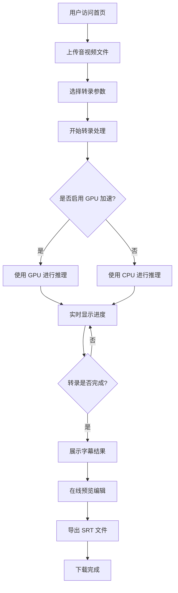

# VoiceTrace 产品需求文档

## 1. 产品概述

VoiceTrace 是一个基于 faster-whisper 和 FastAPI 的智能语音转字幕 Web 应用，为用户提供高效准确的音视频转录服务。

- 主要目的：解决音视频内容字幕需求，支持多语言识别和 GPU 加速，提供便捷的字幕导出功能

## 2. 核心功能

### 2.1 功能模块

1. **文件上传页面**: 音视频文件上传、格式验证、参数配置
2. **转录处理页面**: 实时进度显示、处理状态监控
3. **字幕浏览页面**: 在线字幕预览、编辑调整、导出下载

### 2.2 页面详情

| 页面名称   | 模块名称   | 功能描述                                                          |
| ------ | ------ | ------------------------------------------------------------- |
| 文件上传页面 | 文件上传组件 | 支持拖拽上传和点击上传，支持常见音视频格式（mp3、wav、mp4、avi、mkv 等），文件大小限制提示         |
| 文件上传页面 | 参数配置面板 | GPU 加速开关、模型选择（tiny、base、small、medium、large）、语言选择（自动检测、中文、英文等） |
| 转录处理页面 | 进度显示组件 | 实时显示转录进度百分比、当前处理状态、预计剩余时间                                     |
| 转录处理页面 | 状态监控面板 | 显示处理日志、错误信息提示、资源使用情况                                          |
| 字幕浏览页面 | 字幕预览组件 | 分段显示字幕内容，支持时间轴定位，文本编辑功能                                       |
| 字幕浏览页面 | 导出下载组件 | SRT 格式导出，文件命名规则：模型名+时间戳，下载按钮                                  |

## 3. 核心流程

用户上传音视频文件 → 选择转录参数（模型、语言、GPU） → 系统进行语音识别转录 → 实时显示处理进度 → 转录完成后展示字幕 → 用户可在线预览编辑 → 导出下载 SRT 字幕文件

## 4. 用户界面设计

### 4.1 设计风格

- 主色调：深蓝色系（#1e3a8a）作为主色，搭配浅灰色背景（#f3f4f6），强调科技感和专业性
- 辅助色：橙色（#f97316）用于重要操作按钮，绿色（#10b981）用于成功状态提示
- 按钮风格：圆角矩形按钮，带有轻微阴影效果，hover 时有颜色渐变动画
- 字体：使用 Inter 作为主字体，清晰易读，标题使用较大字号（24px-32px），正文使用标准字号（14px-16px）
- 布局风格：卡片式布局，顶部导航栏，居中对齐的内容区域，响应式设计
- 图标风格：使用简洁的线性图标，配合文字说明，提升可读性

### 4.2 页面设计概览

| 页面名称   | 模块名称   | UI 元素                            |
| ------ | ------ | -------------------------------- |
| 文件上传页面 | 文件上传组件 | 虚线边框上传区域，支持拖拽高亮，文件列表展示，格式图标，删除按钮 |
| 文件上传页面 | 参数配置面板 | 下拉选择框（模型、语言），开关按钮（GPU 加速），参数说明提示 |
| 转录处理页面 | 进度显示组件 | 圆形进度条，百分比数字，状态文字，动画效果            |
| 转录处理页面 | 状态监控面板 | 日志滚动区域，不同状态颜色标记，时间戳显示            |
| 字幕浏览页面 | 字幕预览组件 | 时间轴滑块，字幕分段卡片，编辑输入框，保存按钮          |
| 字幕浏览页面 | 导出下载组件 | 文件名预览，格式选择，下载按钮，成功提示             |

### 4.3 响应式设计

- 桌面优先设计，在大屏幕上展示完整功能和布局

### 4.4 交互细节

- 文件上传：拖拽时边框高亮动画，上传成功后显示文件信息卡片
- 进度显示：进度条平滑动画，状态切换时有过渡效果
- 字幕编辑：双击字幕段进入编辑模式，支持快捷键操作
- 导出下载：下载按钮点击后显示加载状态，完成后弹出成功提示

