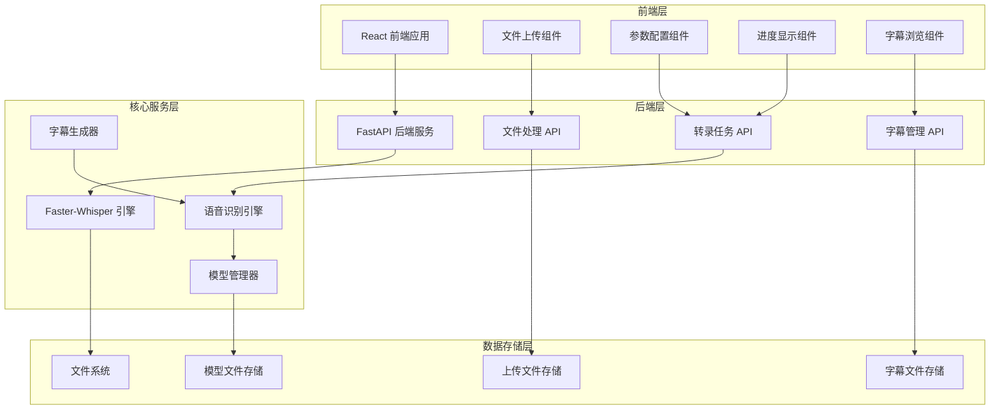
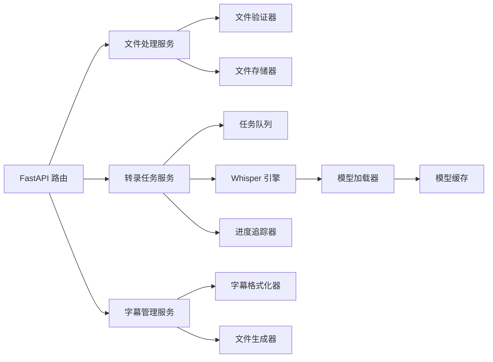
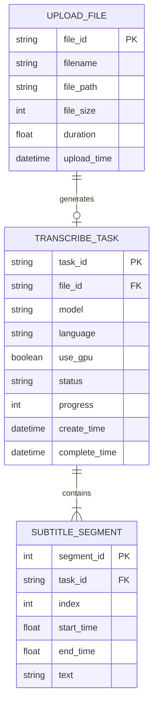

# VoiceTrace 技术架构文档

## 1. 架构设计



## 2. 技术说明

- **前端**: React\@18 + Tailwind CSS\@3 + Vite，使用 TypeScript 进行类型安全开发
- **初始化工具**: Vite（前端）+ uv（Python 项目管理）
- **后端**: FastAPI\@0.104+ + Uvicorn ASGI 服务器
- **核心引擎**: faster-whisper\@1.0+（CTranslate2 优化的 Whisper 模型）
- **数据处理**: Pydantic（数据验证）、python-multipart（文件上传）
- **模型存储**: 本地文件系统，models 文件夹存储 Whisper 模型
- **临时文件**: 上传文件和生成的字幕文件存储在临时目录

## 3. 路由定义

| 路由                        | 用途            |
| ------------------------- | ------------- |
| `/`                       | 前端应用入口页面      |
| `/api/upload`             | 文件上传接口        |
| `/api/transcribe`         | 启动转录任务接口      |
| `/api/status/{task_id}`   | 查询转录状态和进度接口   |
| `/api/subtitle/{task_id}` | 获取字幕结果接口      |
| `/api/download/{task_id}` | 下载 SRT 字幕文件接口 |
| `/api/models`             | 获取可用模型列表接口    |

## 4. API 定义

### 4.1 文件上传 API

```typescript
// POST /api/upload
interface UploadRequest {
  file: File; // 音视频文件
}

interface UploadResponse {
  file_id: string; // 文件唯一标识
  filename: string; // 原始文件名
  file_size: number; // 文件大小（字节）
  duration: number; // 音视频时长（秒）
}
```

### 4.2 转录任务 API

```typescript
// POST /api/transcribe
interface TranscribeRequest {
  file_id: string; // 文件 ID
  model: 'tiny' | 'base' | 'small' | 'medium' | 'large'; // 模型选择
  language?: string; // 语言代码（可选，默认自动检测）
  use_gpu: boolean; // 是否使用 GPU 加速
}

interface TranscribeResponse {
  task_id: string; // 任务唯一标识
  status: 'pending' | 'processing' | 'completed' | 'failed'; // 任务状态
}
```

### 4.3 状态查询 API

```typescript
// GET /api/status/{task_id}
interface StatusResponse {
  task_id: string;
  status: 'pending' | 'processing' | 'completed' | 'failed';
  progress: number; // 进度百分比 0-100
  current_step: string; // 当前处理步骤描述
  error?: string; // 错误信息（如果有）
}
```

### 4.4 字幕获取 API

```typescript
// GET /api/subtitle/{task_id}
interface SubtitleSegment {
  index: number; // 字幕序号
  start: number; // 开始时间（秒）
  end: number; // 结束时间（秒）
  text: string; // 字幕文本
}

interface SubtitleResponse {
  task_id: string;
  model: string; // 使用的模型
  language: string; // 检测到的语言
  segments: SubtitleSegment[]; // 字幕分段列表
}
```

### 4.5 文件下载 API

```typescript
// GET /api/download/{task_id}
// 返回 SRT 格式的字幕文件，文件名格式：{model}_{timestamp}.srt
```

### 4.6 模型列表 API

```typescript
// GET /api/models
interface ModelInfo {
  name: string; // 模型名称
  size: string; // 模型大小
  languages: string[]; // 支持的语言
  downloaded: boolean; // 是否已下载
}

interface ModelsResponse {
  models: ModelInfo[];
}
```

## 5. 服务器架构图



## 6. 数据模型

### 6.1 数据模型定义



### 6.2 数据定义语言

```sql
-- 上传文件记录表
CREATE TABLE upload_files (
    file_id VARCHAR(36) PRIMARY KEY,
    filename VARCHAR(255) NOT NULL,
    file_path VARCHAR(512) NOT NULL,
    file_size INTEGER NOT NULL,
    duration FLOAT,
    upload_time TIMESTAMP DEFAULT CURRENT_TIMESTAMP
);

-- 转录任务表
CREATE TABLE transcribe_tasks (
    task_id VARCHAR(36) PRIMARY KEY,
    file_id VARCHAR(36) NOT NULL,
    model VARCHAR(50) NOT NULL,
    language VARCHAR(10),
    use_gpu BOOLEAN DEFAULT FALSE,
    status VARCHAR(20) DEFAULT 'pending',
    progress INTEGER DEFAULT 0,
    create_time TIMESTAMP DEFAULT CURRENT_TIMESTAMP,
    complete_time TIMESTAMP,
    FOREIGN KEY (file_id) REFERENCES upload_files(file_id)
);

-- 字幕分段表
CREATE TABLE subtitle_segments (
    segment_id INTEGER PRIMARY KEY AUTOINCREMENT,
    task_id VARCHAR(36) NOT NULL,
    index INTEGER NOT NULL,
    start_time FLOAT NOT NULL,
    end_time FLOAT NOT NULL,
    text TEXT NOT NULL,
    FOREIGN KEY (task_id) REFERENCES transcribe_tasks(task_id)
);

-- 创建索引
CREATE INDEX idx_task_status ON transcribe_tasks(status);
CREATE INDEX idx_task_file ON transcribe_tasks(file_id);
CREATE INDEX idx_segment_task ON subtitle_segments(task_id);
```

## 7. 项目目录结构

```
voicetracev2/
├── .trae/
│   └── documents/
│       ├── prd.md
│       └── tech-architecture.md
├── models/                    # Whisper 模型存储目录
├── frontend/                  # 前端项目
│   ├── src/
│   │   ├── components/        # React 组件
│   │   ├── pages/             # 页面组件
│   │   ├── api/               # API 调用封装
│   │   ├── hooks/             # 自定义 Hooks
│   │   └── utils/             # 工具函数
│   ├── public/
│   ├── package.json
│   └── vite.config.ts
├── backend/                   # 后端项目
│   ├── app/
│   │   ├── api/               # API 路由
│   │   ├── services/          # 业务逻辑
│   │   ├── models/            # 数据模型
│   │   └── utils/             # 工具函数
│   └── requirements.txt
├── uploads/                   # 上传文件临时存储
├── outputs/                   # 输出文件存储
├── main.py                    # 后端入口文件
├── pyproject.toml             # Python 项目配置
└── README.md
```

## 8. 关键技术实现

### 8.1 Faster-Whisper 集成

- 使用 faster-whisper 库加载 CTranslate2 优化的 Whisper 模型
- 支持模型自动下载到 `models` 目录，也支持手动放置模型文件
- 通过 `device` 参数控制使用 CPU 或 GPU 推理
- 使用 `compute_type` 参数优化推理性能（int8、float16 等）

### 8.2 实时进度反馈

- 使用 FastAPI 的 BackgroundTasks 异步执行转录任务
- 通过任务状态存储（内存或数据库）记录处理进度
- 前端通过轮询 `/api/status/{task_id}` 接口获取实时进度

### 8.3 字幕格式生成

- 将 Whisper 输出的分段结果转换为 SRT 格式
- 时间戳格式：`HH:MM:SS,mmm`（小时:分钟:秒,毫秒）
- 文件命名：`{model_name}_{YYYYMMDD_HHMMSS}.srt`

### 8.4 文件处理

- 使用 `python-multipart` 处理文件上传
- 支持常见音视频格式：mp3、wav、flac、ogg、mp4、avi、mkv、mov 等
- 使用 `ffmpeg` 获取音视频时长信息
- 上传文件存储在 `uploads` 目录，处理后可选择性清理

### 8.5 GPU 加速支持

- 检测系统 CUDA 环境，动态选择推理设备
- 提供 GPU 可用性检查接口
- 在前端界面显示 GPU 状态和推荐配置

